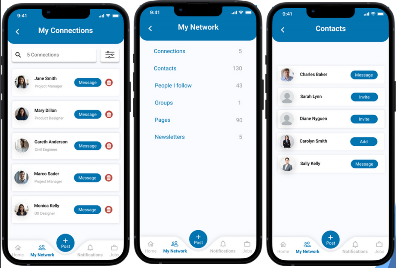

------------------------------------------------------------------------

### INTRODUCTION

LinkedIn is a professional networking platform that allows users to connect, build professional relationships, and identify potential job opportunities. The platform lets users discuss professional content, such as industry developments and new articles. The popular networking platform has since developed a mobile app, allowing users to remain connected while on the move.

This report seeks to identify the usability of the current LinkedIn mobile app and redesign it to improve its usability. To achieve this, the report will follow the structure stated below:

1.  **User Research and Analysis** : Conduct research to assess the general perception towards the application, as well as identify the key users.

2.  **User Goals and Requirements** : The research will then be used to inform the user goals and specific requirements for the application.

3.  **Wireframing** : Provide a low-fidelity overview of the application while considering any new suggestions from the research and identified goals and requirements.

4.  **Prototype** : Provide a functioning application version with the new changes.

5.  

6.  

---

### PROJECT MANAGEMENT METHODOLOGY

